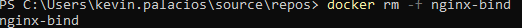
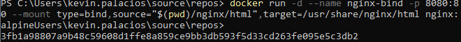

# BIND MOUNT
En un bind mount mapeamos (montar) un directorio o archivo específico del sistema de archivos del host con una parte del sistema de ficheros del contenedor.

```
docker run -d --name <nombre contenedor> -v <ruta carpeta host>:<ruta carpeta contenedor> <imagen> 
```
ó
```
docker run -d --name <nombre contenedor> --mount type=bind,source=<ruta carpeta host>,target=<ruta carpeta contenedor> <imagen>
```
- destination, dst, target: La ruta donde se monta el archivo o directorio en el contenedor.
- source, src: El origen del montaje.
  
### En tu computador crear una carpeta llamada nginx y dentro de esta carpeta crea otra llamada html. Como se aprecia en la figura.


### Crear un contenedor con la imagen nginx:alpine, mapear todos por puertos, para la ruta carpeta host colocar el directorio en donde se encuentra la carpeta html en tu computador y para la ruta carpeta contenedor: /usr/share/nginx/html (esta ruta se obtiene al revisar la documentación de la imagen)

Para ello se usa el siguiente comando en el bash de tu computador: 

```
docker run -d --name nginx-bind -p 8080:80 --mount type=bind,source="$(pwd)/nginx/html",target=/usr/share/nginx/html nginx:alpine

```


# COMPLETAR CON EL COMANDO

### ¿Qué sucede al ingresar al servidor de nginx?
# COMPLETAR CON LA RESPUESTA A LA PREGUNTA

pues se muestra el error 403 Forbidden porque la carpeta html no tiene un archivo index.html

### ¿Qué pasa con el archivo index.html del contenedor?
# COMPLETAR CON LA RESPUESTA A LA PREGUNTA

Se encontraba vacío por ello no se podía mostrar nada.
Después se creó un archivo index.html en la carpeta html que muestre algo de información.

### Ir a https://html5up.net/ y descargar un template gratuito, descomprirlo dentro de tu computador en la carpeta html
### ¿Qué sucede al ingresar al servidor de nginx?
# COMPLETAR CON LA RESPUESTA A LA PREGUNTA

En realidad se muestra el template descargado.
Fue mucho mas rápido que crear un contenedor con volume.

### Eliminar el contenedor
# COMPLETAR CON EL COMANDO

docker rm -f nginx-bind



### ¿Qué sucede al crear nuevamente un contenedor montado al directorio definidos anteriormente?
# COMPLETAR CON LA RESPUESTA A LA PREGUNTA



volvió a salir el error 403 Forbidden porque la carpeta html no tiene un archivo index.html pero eso era porque tenía un comando anterior que no tenía el mount, por lo que se ejecutó el comando nuevamente con el mount y se pudo ver el template.

Después de eso se procedió a eliminar el contenedor y se creó uno nuevo con el mismo comando pero con el mount, y se pudo ver el template.