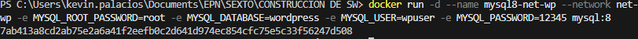
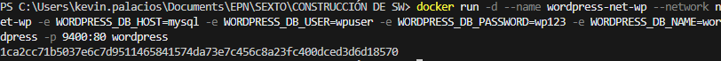

## Esquema para el ejercicio

### Crear red net-wp
# COMPLETAR CON EL COMANDO COMANDO

docker network create net-wp

### Para que persista la información es necesario conocer en dónde mysql almacena la información.
# COMPLETAR LA SIGUIENTE ORACIÓN. REVISAR LA DOCUMENTACIÓN DE LA IMAGEN EN https://hub.docker.com/
En el esquema del ejercicio carpeta del contenedor (a) es (COMPLETAR CON LA RUTA)

docker inspect mysql
la ruta de a es /var/lib/docker/volumes/81968eef96438ac8d30b3fbf45f91dbb167eae6faf4d96a423155e6523110d52/_datal

Ruta carpeta host: .../ejercicio3/db

docker inspect wordpress
la ruta de b es /var/lib/docker/volumes/418238dfca1f740e59f2e3d442816b44c1afb3378db2ce9fcd6603ac4f3f48a5/_data

eso se puede saber con el comando:

docker inspect wordpress | Select-String -Pattern "Mounts" -Context 10

### ¿Qué contiene la carpeta db del host?
# COMPLETAR CON LA RESPUESTA A LA PREGUNTA

contiene todos los archivos de WordPress: archivos PHP, temas, plugins, uploads de medios, configuración, etc.

### Crear un contenedor con la imagen mysql:8  en la red net-wp, configurar las variables de entorno: MYSQL_ROOT_PASSWORD, MYSQL_DATABASE, MYSQL_USER y MYSQL_PASSWORD
# COMPLETAR CON EL COMANDO

el comando para ello es: 

docker run -d --name mysql --network net-wp -e MYSQL_ROOT_PASSWORD=root -e MYSQL_DATABASE=wordpress -e MYSQL_USER=wpuser -e MYSQL_PASSWORD=wp123 mysql:8

### ¿Qué observa en la carpeta db que se encontraba inicialmente vacía?
# COMPLETAR CON LA RESPUESTA A LA PREGUNTA

Pues se observa que la carpeta db ahora contiene los archivos de WordPress, incluyendo los archivos PHP, temas, plugins, uploads de medios, configuración, etc.

Para observar los cambios en la carpeta db, se puede usar el comando:

docker ps
y luego:

docker inspect mysql
finalmente se puede ver la ruta de la carpeta del contenedor (a) en la sección "Mounts" -> "Destination"
para saber el path completo se puede usar el comando:

docker inspect mysql | Select-String -Pattern "Mounts" -Context 10

### Para que persista la información es necesario conocer en dónde wordpress almacena la información.

# COMPLETAR LA SIGUIENTE ORACIÓN. REVISAR LA DOCUMENTACIÓN DE LA IMAGEN EN https://hub.docker.com/
En el esquema del ejercicio la carpeta del contenedor (b) es (COMPLETAR CON LA RUTA)

Ruta carpeta host: .../ejercicio3/www

### Crear un contenedor con la imagen wordpress en la red net-wp, configurar las variables de entorno WORDPRESS_DB_HOST, WORDPRESS_DB_USER, WORDPRESS_DB_PASSWORD y WORDPRESS_DB_NAME (los valores de estas variables corresponden a los del contenedor creado previamente) y en los puertos 8080:80

# COMPLETAR CON EL COMANDO

el comando para ello es: 

docker run -d --name wordpress --network net-wp -p 9400:80 -e WORDPRESS_DB_HOST=mysql -e WORDPRESS_DB_USER=wpuser -e WORDPRESS_DB_PASSWORD=wp123 -e WORDPRESS_DB_NAME=wordpress wordpress

### Personalizar la apariencia de wordpress y agregar una entrada

si sale un error de error establezca la conexión con la base de datos, reinicie el contenedor de mysql y vuelva a intentarlo.
Si aun así no funciona, reinicie el contenedor de wordpress y vuelva a intentarlo.
Deben estar en la misma red o tener la misma network.
comprobamos con el comando:

docker network inspect net-wp

si se encuentran en la misma red, entonces deben poder comunicarse entre sí.
podemos probarlo con el comando:

docker exec -it wordpress-net-wp ping mysql

### Eliminar el contenedor y crearlo nuevamente, ¿qué ha sucedido?

# COMPLETAR CON LA RESPUESTA A LA PREGUNTA 

cuando eliminamos el contenedor y lo creamos nuevamente, se mantiene la información porque la base de datos se encuentra en la carpeta db que es la que se mantiene persistente.
Como en el ejercicio anterior, la carpeta db es la que se mantiene persistente y los datos no se pierden, como se queda guardado el inicio de sesion de wordpress y se tiene la plantilla personalizada.